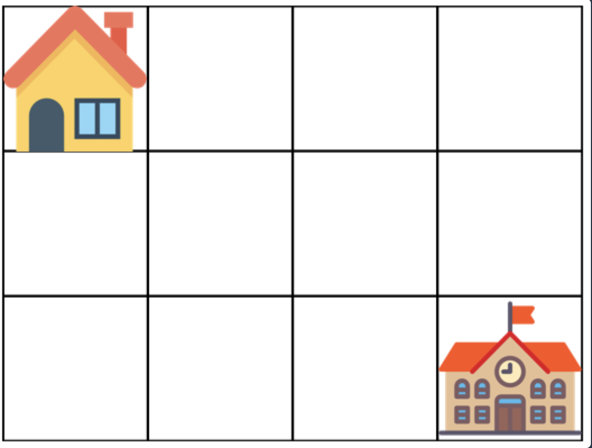
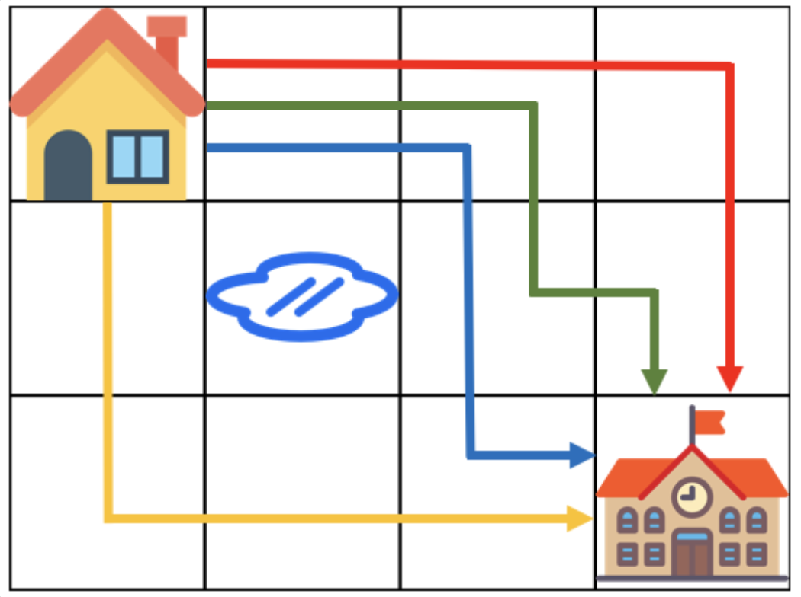

# 등굣길

## 문제 설명

계속되는 폭우로 일부 지역이 물에 잠겼습니다.

물에 잠기지 않은 지역을 통해 학교를 가려고 합니다. 집에서 학교까지 가는 길은 `m × n` 크기의 격자 모양으로 나타낼 수 있습니다.

아래 그림은 `m = 4`, `n = 3`인 경우입니다.

가장 왼쪽 위, 즉 집이 있는 곳의 좌표는 `(1, 1)`로 나타내고 가장 오른쪽 아래, 즉 학교가 있는 곳의 좌표는 `(m, n)`으로 나타냅니다.

격자의 크기 `m`, `n`과 물이 잠긴 지역의 좌표를 담은 2차원 배열 `puddles`가 매개변수로 주어집니다.

오른쪽과 아래쪽으로만 움직여 집에서 학교까지 갈 수 있는 최단 경로의 개수를 `1,000,000,007`로 나눈 나머지를 return 하도록 `solution` 함수를 작성해주세요.

## 제한사항

- 격자의 크기 `m`, `n`은 `1` 이상 `100` 이하인 자연수입니다.
- `m`과 `n`이 모두 `1`인 경우는 입력으로 주어지지 않습니다.
- 물에 잠긴 지역은 `0`개 이상 `10`개 이하입니다.
- 집과 학교가 물에 잠긴 경우는 입력으로 주어지지 않습니다.

## 입출력 예

| m | n | puddles | return |
| ---: | ---: | --- | ---: |
| 4 | 3 | `[[2, 2]]` | 4 |

## 입출력 예 설명

